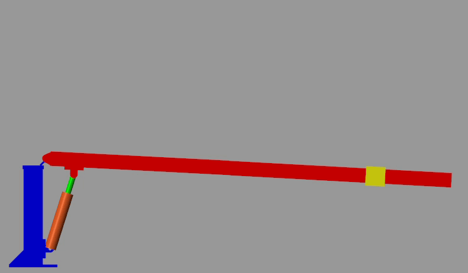

# Design-of-a-control-algorithm-for-a-hydraulically-driven-crane
This project studies a hydraulically driven crane. The crane is modeled using SolidWorks software and imported to MATLAB Simulink. The crane’s dynamic performance is investigated. First a simple signal is imposed to the hydraulic valve to change spool position and study performance of mechanical and hydraulic system. After adjustment the model is improved by considering flexibility of lift arm and variable displacement pump. Finally, the performance of model is compared with experimental data by adding a PI controller and tuning the location of the piston. Results show that the model was able to follow the input signal properly. 

## 🎬 System Demonstration

## 💻 Report

You can find report here:  
📁 [Report (pdf File)](docs/Report.pdf)
